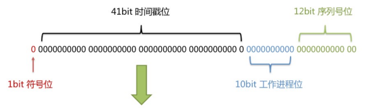

#  一、MyBatis-Plus简介

> 第一章摘自https://baomidou.com/pages/24112f，新手还是手打增强印象！

## 1、简介

MyBatis-plus(简称MP)是一个MyBatis的增强工具，在MyBatis的基础上只做增强不做改变，为简化开发、提高效率而生。


## 2、特性

- 无侵入：只做增强不做改变，引入它不会对现有工程产生影响，如丝般顺滑
- 损耗小：启动即会自动注入基本的CURD，性能基本无损耗，直接面对对象操作
- 强大的CURD操作：内置通用的Mapper，通用的Service，仅仅通过少量配置即可实现单表大部分的CURD操作，更有强大的条件构造器，满足各类使用需求
- 支持Lambda形式调用：通过Lambda表达式，方便的编写各类查询条件，无需再担心字段写错
- 支持主键自动生成：支持多达四种主键策略（内含分布式唯一ID生成器-Sequence），可自由配置，完美解决主键问题
- 支持ActiveRecord模式：支持ActiveRecord形式调用，实体类只需继承Model类即可进行强大的CURD操作
- 支持自定义全局通过操作：支持全局通用方法注入（Write Once,use anywhere）
- 内置代码生成器：采用代码或Maven插件可快速生成Mapper、Model、Service、Controller层代码，支持模板引擎，更有超多的自定义配置等您来使用
- 内置分页插件：基于Mybatis物流分页，开发者无需关心具体操作，配置好插件之后，写分页等同于普通的List查询
- 分页插件支持多种数据库：支持Mysql、MariaDB、Oracle、DB2、H2、HSQL、SQLite、Postgre、SQLServer等多种数据库
- 内置性能分析插件：可输出SQL语句以及其执行时间，建议开发测试是启用该功能，快速定位出慢查询
- 内置全局拦截插件：提供全表delete、update操作智能分析阻断、也可自定义拦截规则，预防误操作

## 3、支持的数据库

常规数据库：Mysql，Oracle，PostgreSQL，OceanBase

更多查看官网


## 4、框架结构


# 二、入门案例

## 1、开发环境

IDE：idea 2020.2

JDK：1.8_332

构建工具：3.5.4

Mysql版本：8.0.12

Spring Boot:2.7.1

MyBatis-Plus:3.3.1


## 2、创数据库和表

创建表

```mysql
CREATE DATABASE `mybatis_plus` /*!40100 DEFAULT CHARACTER SET utf8mb4 */;
use `mybatis_plus`;
CREATE TABLE `user` (
`id` bigint(20) NOT NULL COMMENT '主键ID',
`name` varchar(30) DEFAULT NULL COMMENT '姓名',
`age` int(11) DEFAULT NULL COMMENT '年龄',
`email` varchar(50) DEFAULT NULL COMMENT '邮箱',
PRIMARY KEY (`id`)
) ENGINE=InnoDB DEFAULT CHARSET=utf8;
```

添加数据

```mysql
INSERT INTO user (id, name, age, email) VALUES
(1, 'Jone', 18, 'test1@baomidou.com'),
(2, 'Jack', 20, 'test2@baomidou.com'),
(3, 'Tom', 28, 'test3@baomidou.com'),
(4, 'Sandy', 21, 'test4@baomidou.com'),
(5, 'Billie', 24, 'test5@baomidou.com');
```

## 3、创建Spring Boot 工程

- 选择Spring Initializr 
- 引入依赖

```xml
<dependencies>
		<dependency>
			<groupId>org.springframework.boot</groupId>
			<artifactId>spring-boot-starter</artifactId>
		</dependency>

		<dependency>
			<groupId>org.springframework.boot</groupId>
			<artifactId>spring-boot-starter-test</artifactId>
			<scope>test</scope>
		</dependency>

		<dependency>
			<groupId>com.baomidou</groupId>
			<artifactId>mybatis-plus-boot-starter</artifactId>
			<version>3.3.1</version>
		</dependency>

		<dependency>
			<groupId>org.projectlombok</groupId>
			<artifactId>lombok</artifactId>
			<version>1.18.24</version>
		</dependency>

		<dependency>
			<groupId>mysql</groupId>
			<artifactId>mysql-connector-java</artifactId>
			<version>8.0.28</version>
		</dependency>
	</dependencies>
```

- idea中安装lombok插件


## 4、编写代码

- 配置application.yml( 不同版本的驱动、url配置不同，太常见的几个，百度就知)

```yaml
spring:
  # 配置数据源信息
  datasource:
    # 配置数据源类型
    type: com.zaxxer.hikari.HikariDataSource
    # 配置连接数据库的各个信息
    driver-class-name: com.mysql.cj.jdbc.Driver
    url: jdbc:mysql://localhost:3306/mybatis_plus?serverTimezone=GMT%2B8&characterEncoding=utf-8&useSSL=false
    username: root
    password: 123456
```

- 启动类

> 在Spring Boot启动类中添加@MapperScan注解，扫描mapper包

```java
@SpringBootApplication
@MapperScan("com.xiaotu.mybaisplus.mapper")
public class MybatisPlusDemoApplication {

	public static void main(String[] args) {
		SpringApplication.run(MybatisPlusDemoApplication.class, args);
	}

}
```

- 添加实体

```java
@Data //lombok注解
public class User {
  private Long id;
  private String name;
  private Integer age;
  private String email;
}
```

User编译后即可增加各类方法

- 添加mapper

  > BaseMapper是MyBatis-Plus提供的模板mapper，其中包含基本的CRUD方法，泛型为操作的实体类型

```java
public interface UserMapper extends BaseMapper<User> {
}
```

- 测试

```java
@SpringBootTest
public class MybatisPlusTest {
    @Autowired
    private UserMapper userMapper;

    @Test
    public void testSelectList(){
        userMapper.selectList(null).forEach(System.out::println);
    }

}
```

- 添加日志

在application.yml中

```
mybatis-plus:
  configuration:
    log-impl: org.apache.ibatis.logging.stdout.StdOutImpl
```


# 三、基本的CRUD

## 1、BaseMapper

MyBatis-Plus中的基本CRUD在内置的BaseMapper中都已得到了实现，我们可以直接使用，接口如下：

```java
public interface BaseMapper<T> extends Mapper<T> {
	
   /**
  	* 插入一条记录
  	* @param entity 实体对象
  	*/
    int insert(T entity);

    /**
  	* 根据ID删除
  	* @param id 主键ID
  	*/
    int deleteById(Serializable id);

    /**
  	* 根据ID删除
  	* @param entity 实体对象
  	*/
    int deleteById(T entity);

    /**
  	* 根据columnMap条件删除
  	* @param columnMap 表字段 map对象
  	*/
    int deleteByMap(@Param("cm") Map<String, Object> columnMap);

    /**
  	* 根据entity条件删除记录
  	* @param queryWrapper实体对象封装操作类（可以为null，里面的entity用于生where语句）
  	*/
    int delete(@Param("ew") Wrapper<T> queryWrapper);

    /**
  	* 根据ID批量删除
  	* @param idList 不能为null或empty
  	*/
    int deleteBatchIds(@Param("coll") Collection<?> idList);

    /**
  	* 根据ID修改
  	* @param entity实体对象
  	*/
    int updateById(@Param("et") T entity);

    /**
  	 * 根据 whereEntity 条件，更新记录
  	 * @param entity    实体对象 (set 条件值,可以为 null)
  	 * @param updateWrapper 实体对象封装操作类（可以为 null,里面的 entity 用于生成
where 语句）
  	 */
    int update(@Param("et") T entity, @Param("ew") Wrapper<T> updateWrapper);

    /**
  	* 根据 ID 查询
  	* @param id 主键ID
  	*/
    T selectById(Serializable id);

    /**
  	* 查询（根据ID 批量查询）
  	* @param idList 主键ID列表(不能为 null 以及 empty)
  	*/
    List<T> selectBatchIds(@Param("coll") Collection<? extends Serializable> idList);

    /**
  	* 查询（根据 columnMap 条件）
  	* @param columnMap 表字段 map 对象
  	*/
    List<T> selectByMap(@Param("cm") Map<String, Object> columnMap);
    
	/**
    * 根据 entity 条件，查询一条记录
  	* 查询一条记录，例如 qw.last("limit 1") 限制取一条记录, 注意：多条数据会报异常
  	* @param queryWrapper 实体对象封装操作类（可以为 null）
  	*/
    default T selectOne(@Param("ew") Wrapper<T> queryWrapper) {
        List<T> ts = this.selectList(queryWrapper);
        if (CollectionUtils.isNotEmpty(ts)) {
            if (ts.size() != 1) {
                throw ExceptionUtils.mpe("One record is expected, but the query result is multiple records", new Object[0]);
            } else {
                return ts.get(0);
            }
        } else {
            return null;
        }
    }

    /**
    * 根据 Wrapper 条件，查询是否存在记录
  	* @param queryWrapper 实体对象封装操作类（可以为 null）
  	*/
    default boolean exists(Wrapper<T> queryWrapper) {
        Long count = this.selectCount(queryWrapper);
        return null != count && count > 0L;
    }

    /**
    * 根据 Wrapper 条件，查询总记录数
  	* @param queryWrapper 实体对象封装操作类（可以为 null）
  	*/
    Long selectCount(@Param("ew") Wrapper<T> queryWrapper);

    /**
  	* 根据 entity 条件，查询全部记录
  	* @param queryWrapper 实体对象封装操作类（可以为 null）
  	*/
    List<T> selectList(@Param("ew") Wrapper<T> queryWrapper);

    /**
  	* 根据 Wrapper 条件，查询全部记录
  	* @param queryWrapper 实体对象封装操作类（可以为 null）
  	*/
    List<Map<String, Object>> selectMaps(@Param("ew") Wrapper<T> queryWrapper);

    /**
  	* 根据 Wrapper 条件，查询全部记录
  	* <p>注意： 只返回第一个字段的值</p>
  	* @param queryWrapper 实体对象封装操作类（可以为 null）
  	*/
    List<Object> selectObjs(@Param("ew") Wrapper<T> queryWrapper);

    /**
  	* 根据 entity 条件，查询全部记录（并翻页）
  	* @param page     分页查询条件（可以为 RowBounds.DEFAULT）
  	* @param queryWrapper 实体对象封装操作类（可以为 null）
  	*/
    <P extends IPage<T>> P selectPage(P page, @Param("ew") Wrapper<T> queryWrapper);

    /**
  	* 根据 Wrapper 条件，查询全部记录（并翻页）
  	* @param page     分页查询条件
  	* @param queryWrapper 实体对象封装操作类
  	*/
    <P extends IPage<Map<String, Object>>> P selectMapsPage(P page, @Param("ew") Wrapper<T> queryWrapper);
}
```


## 2、插入

```java
    @Test
    public void testInsert(){
        User user = new User(null,"张三",18,"zhangsan@qq.com");
        int result = userMapper.insert(user);
        System.out.println("受影响的行数："+result );
        System.out.println("id自动获取:"+user.getId());
    }
```

> id自动获取:1548864157437214722。默认使用了雪花算法


## 3、删除

- 根据ID删除

```java
    @Test
    public void testDeleteById(){
        int result = userMapper.deleteById(1548864157437214722L);
        System.out.println("受影响的行数："+result );
    }
```

- 根据Ids删除

```java
    @Test
    public void testDeleteByIds(){
        List<Long> idList = Arrays.asList(1L,2L,3L);
        int result = userMapper.deleteBatchIds(idList);
        System.out.println("受影响的行数："+result );
    }
```

- 根据map删除

```java
    @Test
    public void testDeleteByMap(){
        Map<String,Object> map = new HashMap<>();
        map.put("age",18);
        map.put("name","张三");
        int result = userMapper.deleteByMap(map);
        System.out.println("受影响的行数："+result );
    }
```


## 4、修改

```java
    @Test
    public void testUpdateById(){
        User user = new User(4L,"admin",22,null);
        int result = userMapper.updateById(user);
        System.out.println(result);
    }
```


## 5、查询

- 根据ID查询

```java
@Test
public void testSelectById(){
    User user = userMapper.selectById(4L);
    System.out.println(user);
}
```


- 根据Ids查询

```java
@Test
public void testSelectByIds(){
    List<Long> idList = Arrays.asList(4L,5L);
    List<User> userList = userMapper.selectBatchIds(idList);
    System.out.println(userList);
}
```


- 根据map查询

```java
@Test
public void testSelectByMap(){
    Map<String,Object> map = new HashMap<>();
    map.put("age",22);
    map.put("name","admin");
    List<User> list = userMapper.selectByMap(map);
    System.out.println(list);
}
```


- 查询所有数据

```java
@Test
public void testSelectList(){
    userMapper.selectList(null).forEach(System.out::println);
}
```


## 6、通用的Service

> 说明
>
> - 通用的Service封装了IService接口，进一步封装CRUD采用`get 查询单行` `remove删除` `list查询集合` `page 分页`前缀命名方式区分Mapper层避免混淆
> - 泛型`T`为任意实体对象
> - 建议如果存在自定义通用Service方法的可能，请创建自己的`IBaseService`继承`Mybatis-Plus`提供的基类
> - 官网地址：https://baomidou.com/pages/49cc81/#service-crud-%E6%8E%A5%E5%8F%A3

- IService 

MyBatis-Plus中有一个接口IService和其实现类ServiceImpl，封装了常见的业务层逻辑

- 创建Service接口

```java
//UserService继承IService的基本模板
public interface UserService extend IService<User>{

}
```

- 实现类

```java
package com.xiaotu.mybatisplus.service.impl;

import com.baomidou.mybatisplus.extension.service.impl.ServiceImpl;
import com.xiaotu.mybatisplus.mapper.UserMapper;
import com.xiaotu.mybatisplus.poji.User;
import com.xiaotu.mybatisplus.service.UserService;
import org.springframework.stereotype.Service;
/**
* ServiceImpl实现了IService，提供了IService中基础功能的实现
* 若ServiceImpl无法满足业务需求，则可以使用自定的UserService定义方法，并在实现类中实现
*/
@Service
public class UserServiceImpl extends ServiceImpl<UserMapper, User> implements UserService {
}

```


# 四、常用注解

##  1、@TableName

> 经过以上的测试，在使用MyBatis-Plus实现基本的CRUD时，我们并没有指定要操作的表，只是在
> Mapper接口继承BaseMapper时，设置了泛型User，而操作的表为user表
> 由此得出结论，MyBatis-Plus在确定操作的表时，由BaseMapper的泛型决定，即实体类型决
> 定，且默认操作的表名和实体类型的类名一致

- 若泛型User和实际表名不一致会出现，table  xxx dont exists的报错。
- 在实体类上加上@TableName("t_user")可解决
- 通过全局配置

```yaml
mybatis-plus:
  configuration:
    log-impl: org.apache.ibatis.logging.stdout.StdOutImpl
#设置MyBatis-Plus的全局配置
  global-config:
    db-config:
      #设置实体类所对应的表的统一前缀
      table-prefix: t_
```


## 2、@TableId

> 经过以上的测试，MyBatis-Plus在实现CRUD时，会默认将id作为主键列，并在插入数据时，默认
> 基于雪花算法的策略生成id

- 问题

> 若实体类和表中表示主键的不是id，而是其他字段，例如uid，MyBatis-Plus会自动识别uid为主
> 键列吗？

- 通过@TableId解决问题

在实体类中uid属性上通过@TableId将其标识为主键，即可成功执行SQL语句

- @TableId的value属性

若实体类中主键对应的属性为id，而表中表示主键的字段为uid，此时若只在属性id上添加注解
@TableId，则抛出异常Unknown column 'id' in 'field list'，即MyBatis-Plus仍然会将id作为表的
主键操作，而表中表示主键的是字段uid
此时需要通过@TableId注解的value属性，指定表中的主键字段，@TableId("uid")或
@TableId(value="uid")

- @TableId的type属性

常用的主键策略(源码里还有其他几种类型 可以详细看)

| 值                     | 描述                                                         |
| ---------------------- | ------------------------------------------------------------ |
| IdType.ASSIGN_ID(默认) | 基于雪花算法的策略生成数据id，与数据库id是否设置自增无关     |
| IdType.AUTO            | 使用数据库的自增策略，注意，该类型请确保数据库设置了id自增，否则无效 |


- 雪花算法

  背景：为了应对数据规模的增长，以应对逐渐增长的访问压力和数据量。
  数据库的扩展方式主要包括：业务分库、主从复制，数据库分表

  	 

雪花算法是由Twitter公布的分布式主键生成算法，它能够保证不同表的主键的不重复性，以及相同表的
主键的有序性。
①核心思想：
长度共64bit（一个long型）。
首先是一个符号位，1bit标识，由于long基本类型在Java中是带符号的，最高位是符号位，正数是0，负
数是1，所以id一般是正数，最高位是0。
41bit时间截(毫秒级)，存储的是时间截的差值（当前时间截 - 开始时间截)，结果约等于69.73年。
10bit作为机器的ID（5个bit是数据中心，5个bit的机器ID，可以部署在1024个节点）。
12bit作为毫秒内的流水号（意味着每个节点在每毫秒可以产生 4096 个 ID）



②优点：整体上按照时间自增排序，并且整个分布式系统内不会产生ID碰撞，并且效率较高。

## 3、@TableField

>MyBatis-Plus在执行SQL语句时，要保证实体类中的属性名和表中的字段名一致
>如果实体类中的属性名和字段名不一致的情况，会出现什么问题呢？

- 情况1

  若实体类中的属性使用的是驼峰命名风格，而表中的字段使用的是下划线命名风格
  例如实体类属性userName，表中字段user_name
  此时MyBatis-Plus会自动将下划线命名风格转化为驼峰命名风格
  相当于在MyBatis中配置

- 情况2
  若实体类中的属性和表中的字段不满足情况1
  例如实体类属性name，表中字段username
  此时需要在实体类属性上使用@TableField("username")设置属性所对应的字段名


## 4、@TableLogic

逻辑删除

增加一个字段用于表示是否删除

```java
@TableLogic
private Interget isDeleted
```

测试

删除：

```sql
UPDATE t_user SET is_deleted=1 WHERE id=? AND is_deleted=0
```

查询：

```sql
SELECT id,name,age,email,is_deleted FROM t_user WHERE id IN ( ? , ? ) AND is_deleted=0
```


# 五、条件构建器和常用接口

## 1、wapper介绍


- Wrapper ： 条件构造抽象类，最顶端父类
  - AbstractWrapper ： 用于查询条件封装，生成 sql 的 where 条件
    - QueryWrapper ： 查询条件封装
    - UpdateWrapper ： Update 条件封装
    - AbstractLambdaWrapper ： 使用Lambda 语法
      - LambdaQueryWrapper ：用于Lambda语法使用的查询Wrapper
      - LambdaUpdateWrapper ： Lambda 更新封装Wrapper


## 2、QueryWapper

- 组装查询条件

```java
    @Test
    public void test01(){
        //查询用户名包含a,年龄在20至30岁之前，并且邮箱不为null的用户信息
        //select id,username as name,age,email,is_deleted from t_user where
        // is_deleted=0 and (username like ? and age between ? and ? and email is not null )

        QueryWrapper<User> queryWrapper = new QueryWrapper<>();
        queryWrapper.like("username","a")
                .between("age",20,30)
                .isNotNull("email");
        List<User> list = userMapper.selectList(queryWrapper);
        list.forEach(System.out::println);
    }
```


- 组装排序条件

```java
    @Test
    public void test02(){
        //按年龄降序查询用户，如果年龄相同则按id升序排列
        //select id,username as name,age,email,is_deleted from t_user  where is_deleted=0  order by age desc ,id asc

        QueryWrapper<User> queryWrapper = new QueryWrapper<>();
        queryWrapper.orderByDesc("age").orderByAsc("id");
        List<User> list = userMapper.selectList(queryWrapper);
        list.forEach(System.out::println);
    }
```


- 组装删除条件

```java
    @Test
    public void test03(){
        //删除email为空的用户
        //DELETE FROM t_user WHERE (email IS NULL)

        QueryWrapper<User> queryWrapper = new QueryWrapper<>();
        queryWrapper.isNull("email");
        int result  = userMapper.delete(queryWrapper);
        System.out.println("受影响的行数：" + result);
    }
```


- 条件的优先级

```java
    @Test
    public void test03(){
        //删除email为空的用户
        //DELETE FROM t_user WHERE (email IS NULL)

        QueryWrapper<User> queryWrapper = new QueryWrapper<>();
        queryWrapper.isNull("email");
        int    @Test
    public void test04(){
        //将（年龄大于20并且用户名中包含有a）或邮箱为null的用户信息修改
        //UPDATE t_user SET age=?, email=? WHERE (username LIKE ? AND age > ? OR email IS NULL)

        QueryWrapper<User> queryWrapper = new QueryWrapper<>();
        queryWrapper.like("username","a")
                .gt("age",20)
                .or()
                .isNull("email");
        User user = new User();
        user.setAge(18);
        user.setEmail("cuixiaotu@gmail.com");
        int result = userMapper.update(user,queryWrapper);
        System.out.println("受影响的行数：" + result);
    }tem.out.println("受影响的行数：" + result);
    }
```


```java
    @Test
    public void test04b(){
        //将用户名中包含有a（年龄大于20或或邮箱为null）的用户信息修改
        //UPDATE t_user SET age=?, email=? WHERE (username LIKE ? AND (age > ? OR email IS NULL))

        QueryWrapper<User> queryWrapper = new QueryWrapper<>();
        queryWrapper.like("username","a")
                .and(i->i.gt("age",20).or().isNull("email"));

        User user = new User();
        user.setAge(18);
        user.setEmail("cuixiaotub@gmail.com");
        int result = userMapper.update(user,queryWrapper);
        System.out.println("受影响的行数：" + result);
    }

```


- 组装select子句

```java
    @Test
    public void test05(){
        //查询用户信息的username和age字段
        //SELECT username,age FROM t_user

        QueryWrapper<User> queryWrapper = new QueryWrapper<>();
        queryWrapper.select("username","age");
        //selectMaps()返回Map集合列表，通常配合select()使用，避免User对象中没有被查询到的列值为null
        List<Map<String,Object>> map = userMapper.selectMaps(queryWrapper);
        map.forEach(System.out::println);
    }
```


- 组装子查询

```java
    @Test
    public void test06(){
        //查询id小于等于3的用户信息
        //SELECT id,username AS name,age,email,is_deleted FROM t_user WHERE (id IN (select id from t_user where id <= 3))
        QueryWrapper<User> queryWrapper = new QueryWrapper<>();
        queryWrapper.inSql("id","select id from t_user where id < 30");
        List<User> list = userMapper.selectList(queryWrapper);
        list.forEach(System.out::println);
    }
```


## 3、UpdateWrapper

- 组装删除条件

```java
    @Test
    public void test07(){
        //将（年龄大于20或邮箱为null）并且用户名中包含有a的用户信息修改
        //组装set子句以及修改条件
        UpdateWrapper<User> updateWrapper = new UpdateWrapper<>();
        updateWrapper.set("age",18)
                .set("email","cuixinpk@gmail.com")
                .like("username","a")
                .and(i->i.gt("age",20).or().isNull("email"));
        //这里必须要创建User对象，否则无法应用自动填充。如果没有自动填充，可以设置为null
        //UPDATE t_user SET username=?, age=?,email=? WHERE (username LIKE ? AND (age > ? OR email IS NULL))
        //User user = new User();
        //user.setName("张三");
        //int result = userMapper.update(user, updateWrapper);
        //UPDATE t_user SET age=?,email=? WHERE (username LIKE ? AND (age > ? OR email IS NULL))

        int result = userMapper.update(null,updateWrapper);
        System.out.println(result);
    }
```


## 4、condition

> 在真正开发的过程中，组装条件是常见的功能，而这些条件数据来源于用户输入，是可选的，因
> 此我们在组装这些条件时，必须先判断用户是否选择了这些条件，若选择则需要组装该条件，若
> 没有选择则一定不能组装，以免影响SQL执行的结果

思路一：

```java
	@Test
    public void test08(){
        String username = null;
        Integer ageBegin = 10;
        Integer ageEnd = 24;
        QueryWrapper<User> queryWrapper = new QueryWrapper<>();
        //StringUtils.isNotBlank()判断某字符串是否不为空且长度不为0且不由空白符(whitespace)构成
        if (StringUtils.isNotBlank(username)){
            queryWrapper.like("username","a");
        }
        if (ageBegin != null){
            queryWrapper.ge("age",ageBegin);
        }
        if (ageEnd != null){
            queryWrapper.le("age",ageEnd);
        }
        //SELECT id,username AS name,age,email,is_deleted FROM t_user WHERE (age >=? AND age <= ?)
        List<User> users = userMapper.selectList(queryWrapper);
        users.forEach(System.out::println);
    }
```


思路二：

```java
    @Test
    public void test08UseCondition(){
        //定义查询条件，有可能为null（用户未输入或未选择）
        String username = null;
        Integer ageBegin = 10;
        Integer ageEnd = 24;

        QueryWrapper<User> queryWrapper = new QueryWrapper<>();
        queryWrapper.like(StringUtils.isNotBlank(username),"username","a")
                .ge(ageBegin!=null,"age",ageBegin)
                .le(ageEnd!=null,"age",ageEnd);

        List<User> users = userMapper.selectList(queryWrapper);
        users.forEach(System.out::println);
    }
```


## 5、LambdaQueryWrapper

```java
    @Test
    public void test09(){
        //定义查询条件，有可能为null（用户未输入）
        String username = "i";
        Integer ageBegin = 10;
        Integer ageEnd = 24;
        LambdaQueryWrapper<User> queryWrapper = new LambdaQueryWrapper<>();
        //避免使用字符串标识字符，防止运行时错误
        queryWrapper.like(StringUtils.isNotBlank(username),User::getName,username)
                .ge(ageBegin != null, User::getAge, ageBegin)
                .ge( ageEnd != null, User::getAge, ageEnd);
        List<User> users = userMapper.selectList(queryWrapper);
        users.forEach(System.out::println);
    }
```


## 6、LambdaUpdateWrapper

```java
    @Test
    public void test10(){
        LambdaUpdateWrapper<User>  updateWrapper = new LambdaUpdateWrapper<>();
        updateWrapper.set(User::getAge,18)
                .set(User::getEmail,"cuixinpk@gmail.com")
                .like(User::getName,"i")
                .and( i->i.lt(User::getAge,24).or().isNull(User::getEmail));
        User user = new User();
        int result = userMapper.update(user,updateWrapper);
        System.out.println("受影响的行数：" + result);
    }
```


# 六、插件

## 1、分页插件

- 添加配置类

```java
@Configuration
@MapperScan("com.xiaotu.mybatisplus.mapper")
public class MyBatisPlusConfig {

    @Bean
    public MybatisPlusInterceptor mybatisPlusInterceptor(){
        MybatisPlusInterceptor interceptor = new MybatisPlusInterceptor();
        interceptor.addInnerInterceptor(new PaginationInnerInterceptor(DbType.MYSQL));
        return interceptor;
    }
}
```


- 测试

```java
	@Test
    public void testPage(){
        //设置分页参数
        Page<User> page = new Page<>(1,5);
        userMapper.selectPage(page,null);
        //获取分页数据
        List<User> list = page.getRecords();
        list.forEach(System.out::println);
        System.out.println("当前页："+page.getCurrent());
        System.out.println("每页显示的条数："+page.getSize());
        System.out.println("总记录数："+page.getTotal());

        System.out.println("总页数："+page.getPages());
        System.out.println("是否有上一页："+page.hasPrevious());
        System.out.println("是否有下一页："+page.hasNext());
    }
```


## 2、xml自定义分页

- UserMapper中定义接口方法

```java
  /*
    * 根据年龄查询用户列表，分页显示
    * @param page 分页对象，xml中可以从里面进行取值，传递参数page即自动分页，必须放在第一位
    * @param age 年纪
    * @return
    * */
    Page<User> selectPageVo(@Param("page") Page<User> page, @Param("age") Integer age);
```

- UserMapper.xml中SQL

```xml-dtd
<?xml version="1.0" encoding="UTF-8" ?>
<!DOCTYPE mapper
        PUBLIC "-//com.xiaotu.mybatis.org//DTD Mapper 3.0//EN"
        "http://mybatis.org/dtd/mybatis-3-mapper.dtd">
<mapper namespace="com.xiaotu.mybatisplus.mapper.UserMapper">
    <sql id="BaseColumns">id,username,age,email</sql>

    <!--  Page<User> selectPageV0(@Param("page") Page<User> page,@Param("age") Integer age);-->
    <select id="selectPageVo" resultType="com.xiaotu.mybatisplus.poji.User">
        select <include refid="BaseColumns"></include> from t_user where age > #{age}
    </select>

</mapper>
```

- 测试

```java
    @Test
    public void testSelectPageVo(){
        //设置分页参数
        Page<User> page = new Page<>(1,5);
        userMapper.selectPageVo(page,10);
        //获取分页数据
        List<User> list = page.getRecords();
        list.forEach(System.out::println);
        System.out.println("当前页："+page.getCurrent());
        System.out.println("每页显示的条数："+page.getSize());
        System.out.println("总记录数："+page.getTotal());

        System.out.println("总页数："+page.getPages());
        System.out.println("是否有上一页："+page.hasPrevious());
        System.out.println("是否有下一页："+page.hasNext());
    }
```


## 3、乐观锁

- 场景

> 一件商品，成本价是80元，售价是100元。老板先是通知小李，说你去把商品价格增加50元。小
> 李正在玩游戏，耽搁了一个小时。正好一个小时后，老板觉得商品价格增加到150元，价格太
> 高，可能会影响销量。又通知小王，你把商品价格降低30元。
> 此时，小李和小王同时操作商品后台系统。小李操作的时候，系统先取出商品价格100元；小王
> 也在操作，取出的商品价格也是100元。小李将价格加了50元，并将100+50=150元存入了数据
> 库；小王将商品减了30元，并将100-30=70元存入了数据库。是的，如果没有锁，小李的操作就
> 完全被小王的覆盖了。
> 现在商品价格是70元，比成本价低10元。几分钟后，这个商品很快出售了1千多件商品，老板亏1
> 万多.

- 乐观锁和悲观锁

> 上面的故事，如果是乐观锁，小王保存价格前，会检查下价格是否被人修改过了。如果被修改过
> 了，则重新取出的被修改后的价格，150元，这样他会将120元存入数据库。
> 如果是悲观锁，小李取出数据后，小王只能等小李操作完之后，才能对价格进行操作，也会保证
> 最终的价格是120元。

- 模拟修改冲突

```sql
CREATE TABLE `mybatis_plus`.`t_product`  (
  `id` bigint(20) NOT NULL AUTO_INCREMENT COMMENT '主键ID',
  `name` varchar(30) CHARACTER SET utf8mb4 COLLATE utf8mb4_0900_ai_ci NULL DEFAULT NULL COMMENT '商品名称',
  `price` int(11) NULL DEFAULT 0 COMMENT '价格',
  `version` int(11) NULL DEFAULT 0 COMMENT '乐观锁版本号',
  PRIMARY KEY (`id`) USING BTREE
) ENGINE = MyISAM AUTO_INCREMENT = 1 CHARACTER SET = utf8mb4 COLLATE = utf8mb4_0900_ai_ci ROW_FORMAT = Dynamic;
```

- 添加数据

```sql
insert into t_product (id,name,price) VALUES (1, '外星人笔记本', 100);
```

- 添加实体

```java
@Data
public class Product {
    private long id;
    private String name;
    private Integer price;
    private Integer version;
}
```

- 添加Mapper

```java
public interface ProductMapper extends BaseMapper<Product> {
}
```

- 测试

```java
    @Test
    public void testConcurrentUpdate() {
        //1、小李
        Product p1 = productMapper.selectById(1L);
        System.out.println("小李取出的价格：" + p1.getPrice());
        //2、小王
        Product p2 = productMapper.selectById(1L);
        System.out.println("小王取出的价格：" + p2.getPrice());
        //3、小李将价格加了50元，存入了数据库
        p1.setPrice(p1.getPrice() + 50);
        int result1 = productMapper.updateById(p1);
        System.out.println("小李修改结果：" + result1);
        //4、小王将商品减了30元，存入了数据库
        p2.setPrice(p2.getPrice() - 30);
        int result2 = productMapper.updateById(p2);
        System.out.println("小王修改结果：" + result2);
        //最后的结果
        Product p3 = productMapper.selectById(1L);
        //价格覆盖，最后的结果：70
        System.out.println("最后的结果：" + p3.getPrice());
    }
```

- 乐观锁实现逻辑

> 数据库中添加version字段
> 取出记录时，获取当前version
>
> ```sql
> SELECT id,`name`,price,`version` FROM product WHERE id=1
> ```
>
> 更新时，version + 1，如果where语句中的version版本不对，则更新失败
>
> ```sql
> UPDATE product SET price=price+50, `version`=`version` + 1 WHERE id=1 AND
> `version`=1
> ```

- Mybatis-Plus乐观锁

  修改实体类  增加注解

  ```sql
  import com.baomidou.mybatisplus.annotation.Version;
  import lombok.Data;
  
  @Data
  public class Product {
      private long id;
      private String name;
      private Integer price;
      @Version
      private Integer version;
  }
  ```

- 添加乐观锁插件

```mysql
interceptor.addInnerInterceptor(new OptimisticLockerInnerInterceptor());
```

- 测试

```java
    @Test
    public void testConcurrentVersionUpdate() {
        //小李取数据
        Product p1 = productMapper.selectById(1L);
        //小王取数据
        Product p2 = productMapper.selectById(1L);
        //小李修改 + 50
        p1.setPrice(p1.getPrice() + 50);
        int result1 = productMapper.updateById(p1);
        System.out.println("小李修改的结果：" + result1);
        //小王修改 - 30
        p2.setPrice(p2.getPrice() - 30);
        int result2 = productMapper.updateById(p2);
        System.out.println("小王修改的结果：" + result2);
        if(result2 == 0){
        //失败重试，重新获取version并更新
        p2 = productMapper.selectById(1L);
        p2.setPrice(p2.getPrice() - 30);
        result2 = productMapper.updateById(p2);
        }
        System.out.println("小王修改重试的结果：" + result2);
        //老板看价格
        Product p3 = productMapper.selectById(1L);
        System.out.println("老板看价格：" + p3.getPrice());
    }
```


# 七、通用枚举

> 表中有些字段值是固定的，例如性别（男或女），此时我们可以使用MyBatis-Plus的通用枚举来实现

- 数据库增加字段sex

- 创建通用枚举类型

  ```java
  package com.xiaotu.mybatisplus.enums;
  
  import com.baomidou.mybatisplus.annotation.EnumValue;
  import lombok.Getter;
  
  @Getter
  public enum  SexEnum {
  
      MALE(1,"男"),
      FEMALE(2,"女");
  
      @EnumValue
      private Integer sex;
      private String sexName;
  
      SexEnum(Integer sex,String sexName) {
          this.sex = sex;
          this.sexName = sexName;
      }
  }
  ```

- 配置扫描通用枚举

  ```yaml
  mybatis-plus:
  configuration:
    # 配置MyBatis日志
   log-impl: org.apache.ibatis.logging.stdout.StdOutImpl
  global-config:
   db-config:
     # 配置MyBatis-Plus操作表的默认前缀
    table-prefix: t_
     # 配置MyBatis-Plus的主键策略
    id-type: auto
   # 配置扫描通用枚举
  type-enumsc-package: com.atguigu.mybatisplus.enums
  ```

- 测试

  ```java
  @SpringBootTest
  public class MyBatisPlusEnumsTest {
  
      @Autowired
      UserMapper userMapper;
  
      @Test
      public void testSexEnum(){
          User user = new User();
          user.setName("Enum");
          user.setAge(20);
          user.setSex(SexEnum.MALE);
          user.setEmail("et@qq.com");
          userMapper.insert(user);
      }
  }
  ```

  

# 八、代码生成器

## 1、引入依赖

```xml
<dependency>
	<groupId>com.baomidou</groupId>
	<artifactId>mybatis-plus-generator</artifactId>
	<version>3.5.1</version>
</dependency>
<dependency>
	<groupId>org.freemarker</groupId>
	<artifactId>freemarker</artifactId>
	<version>2.3.29</version>
</dependency>
```


## 2、快速生成

```java
@SpringBootTest
public class FastAutoGeneratorTest {

    public static void main(String[] args) {
        FastAutoGenerator.create("jdbc:mysql://127.0.0.1:3306/mybatis_plus?characterEncoding=utf-8&userSSL=false", "root", "root")
                .globalConfig(builder -> {
                    builder.author("xiaotu") // 设置作者
                            //.enableSwagger() // 开启 swagger 模式
                            .fileOverride() // 覆盖已生成文件
                            .outputDir("D://mybatis_plus"); // 指定输出目录
                })
                .packageConfig(builder -> {
                    builder.parent("com.xiaotu") // 设置父包名
                            .moduleName("mybatisplus") // 设置父包模块名
                            .pathInfo(Collections.singletonMap(OutputFile.mapperXml, "D://mybatis_plus")); // 设置mapperXml生成路径
                })
                .strategyConfig(builder -> {
                    builder.addInclude("t_user") // 设置需要生成的表名
                            .addTablePrefix("t_", "c_"); // 设置过滤表前缀
                })
                .templateEngine(new FreemarkerTemplateEngine()) // 使用Freemarker引擎模板，默认的是Velocity引擎模板
                .execute();
    }
}
```


# 九、多数据源

> 适用于多种场景：纯粹多库、 读写分离、 一主多从、 混合模式等
> 目前我们就来模拟一个纯粹多库的一个场景，其他场景类似
> 场景说明：
> 我们创建两个库，分别为：mybatis_plus（以前的库不动）与mybatis_plus_1（新建），将
> mybatis_plus库的product表移动到mybatis_plus_1库，这样每个库一张表，通过一个测试用例
> 分别获取用户数据与商品数据，如果获取到说明多库模拟成功


## 1、创建数据库及表

```sql
CREATE DATABASE `mybatis_plus_1` /*!40100 DEFAULT CHARACTER SET utf8mb4 */;
use `mybatis_plus_1`;
CREATE TABLE product
(
`id` BIGINT(20) NOT NULL COMMENT '主键ID',
`name` VARCHAR(30) NULL DEFAULT NULL COMMENT '商品名称',
`price` INT(11) DEFAULT 0 COMMENT '价格',
`version` INT(11) DEFAULT 0 COMMENT '乐观锁版本号',
PRIMARY KEY (`id`)
)
```

> 添加测试数据

```sql
INSERT INTO product (id, NAME, price) VALUES (1, '外星人笔记本', 100);
```

> 删除mybatis_plus库product表

```
use mybatis_plus;
DROP TABLE IF EXISTS product
```

## 2、引入依赖

```xml
<dependency>
	<groupId>com.baomidou</groupId>
	<artifactId>dynamic-datasource-spring-boot-starter</artifactId>
	<version>3.5.0</version>
</dependency>
```


## 3、配置多数据源

```yaml
spring:
  # 配置数据源信息
  datasource:
    dynamic:
      # 设置默认的数据源或者数据源组,默认值即为master
      primary: master
      # 严格匹配数据源,默认false.true未匹配到指定数据源时抛异常,false使用默认数据源
      strict: false
      datasource:
        master:
          url: jdbc:mysql://localhost:3306/mybatis_plus?characterEncoding=utf-8&useSSL=false
          driver-class-name: com.mysql.cj.jdbc.Driver
          username: root
          password: root
        slave_1:
          url: jdbc:mysql://localhost:3306/mybatis_plus_1?characterEncoding=utf-8&useSSL=false
          driver-class-name: com.mysql.cj.jdbc.Driver
          username: root
          password: root

```

## 4、创建用户service

```java
public interface UserService extends IService<User> {
}
```


```java
@DS("master") //指定所操作的数据源
@Service
public class UserServiceImpl extends ServiceImpl<UserMapper, User> implements
UserService {
}
```


## 5、创建用户service

```java
public interface ProductService extends IService<Product> {
}
```


```java
@DS("slave_1")
@Service
public class ProductServiceImpl extends ServiceImpl<ProductMapper, Product>
implements ProductService {
}
```


## 6、测试

```java
@Autowired
private UserService userService;
@Autowired
private ProductService productService;
@Test
public void testDynamicDataSource(){
  System.out.println(userService.getById(1L));
  System.out.println(productService.getById(1L));
}
```

>结果：
>1、都能顺利获取对象，则测试成功
>2、如果我们实现读写分离，将写操作方法加上主库数据源，读操作方法加上从库数据源，自动切
>换，是不是就能实现读写分离？


# 十、MyBatisX插件

> MyBatis-Plus为我们提供了强大的mapper和service模板，能够大大的提高开发效率
> 但是在真正开发过程中，MyBatis-Plus并不能为我们解决所有问题，例如一些复杂的SQL，多表
> 联查，我们就需要自己去编写代码和SQL语句，我们该如何快速的解决这个问题呢，这个时候可
> 以使用MyBatisX插件
> MyBatisX一款基于 IDEA 的快速开发插件，为效率而生

MyBatisX插件用法：https://baomidou.com/pages/ba5b24/

